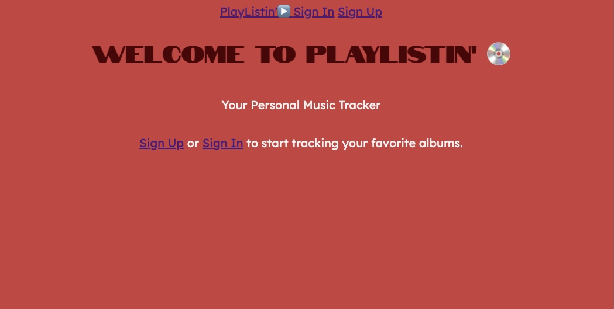

# PlayListin'

### https://playlistin-b93bbc7b368e.herokuapp.com/

## Description
"PlayListin'" is a simple app designed to help you track your favorite albums. When you sign up for PlayListin' you can rate, add your favorite songs, and leave a comment on your favorite albums. You can also view what your others users are listening to in the "Party" feature of the app. When adding albums to your PlayList you have the option to keep the review hidden and add it to your "Guilty Pleasures" PlayList, where you are the only user that can see it.

## Techonologies Used
- HTML5
- CSS3
- JavaScript
- MongoDB

## Planning
For Wireframes and ERD:
https://trello.com/b/NXQgXj5m/albumtracker

## Next Steps
I would like to add a feature that sorts the order of the reviews based on different values like oldest to newest, or highest rated to lowest rated. I also might like to add a communal playlist feature that shows every album that had been rated by every user. 

